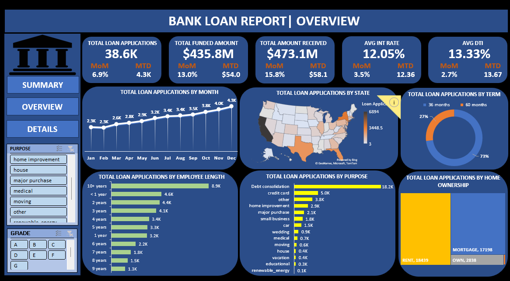
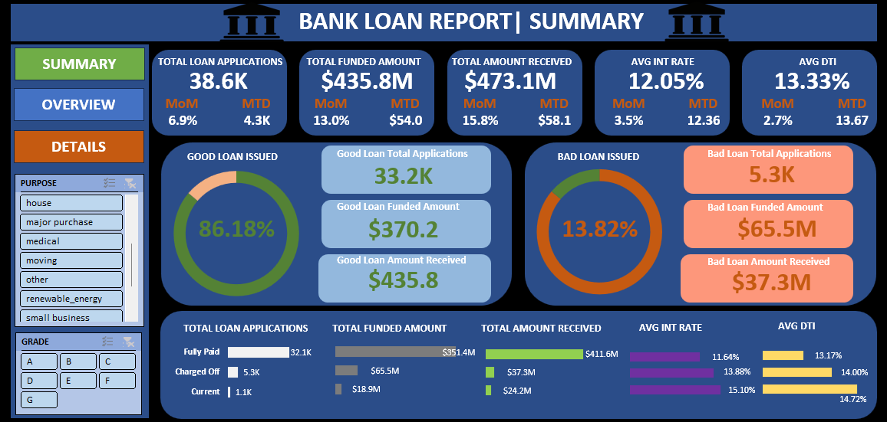

📊 Bank Loan Report Dashboard (SQL + Excel)
📌 Project Overview

This project analyzes bank loan data using SQL queries and visualizes the insights in Excel dashboards.
The objective is to monitor loan applications, funded amounts, repayments, and loan performance (Good vs Bad loans) with interactive filtering options.

## 📸 Dashboard Preview

🗂️ Key Features
A. Bank Loan Report | Summary

KPI’s:

Total Loan Applications

MTD Loan Applications

PMTD Loan Applications

Total Funded Amount

MTD Total Funded Amount

PMTD Total Funded Amount

Total Amount Received

MTD Total Amount Received

PMTD Total Amount Received

Average Interest Rate

MTD Average Interest Rate

PMTD Average Interest Rate

Average DTI (Debt-to-Income Ratio)

MTD Avg DTI

PMTD Avg DTI

Good Loan Issued

Good Loan Percentage

Good Loan Applications

Good Loan Funded Amount

Good Loan Amount Received

Bad Loan Issued

Bad Loan Percentage

Bad Loan Applications

Bad Loan Funded Amount

Bad Loan Amount Received

Loan Status Overview

B. Bank Loan Report | Overview

Breakdown of loans by:

Month

State

Term

Employee Length

Purpose

Home Ownership

🛠️ Tools & Technologies

SQL – Data extraction and aggregation

Excel – Dashboard creation, data visualization, and KPI tracking

📈 Dashboard Highlights

Summary report with key loan metrics

Loan performance comparison (Good vs Bad loans)

Trend analysis by month, state, term, purpose, and ownership

Interactive filters to drill down into loan segments

🚀 How to Use

Run SQL queries on your database to extract and summarize the data.

Load the query results into Excel.

Explore the dashboards with interactive filters to analyze loan performance.

📂 Project Structure
📁 Bank-Loan-Report-Dashboard
│── 📄 README.md                # Project documentation
│── 📄 SQL_Queries.sql          # All SQL queries used for analysis
│── 📊 Bank_Loan_Dashboard.xlsx # Excel dashboard with KPIs & visuals
│── 📄 Data_Dictionary.txt      # Explanation of fields in dataset

✅ Insights

Loan applications and funding trends

Repayment vs funded amount

Good vs Bad loan performance ratios

Loan distribution by customer attributes
